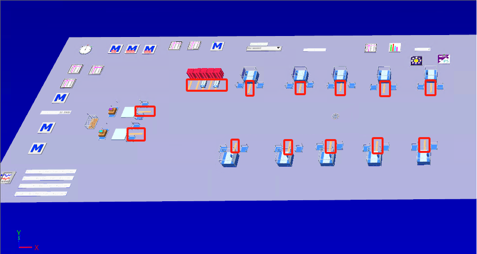
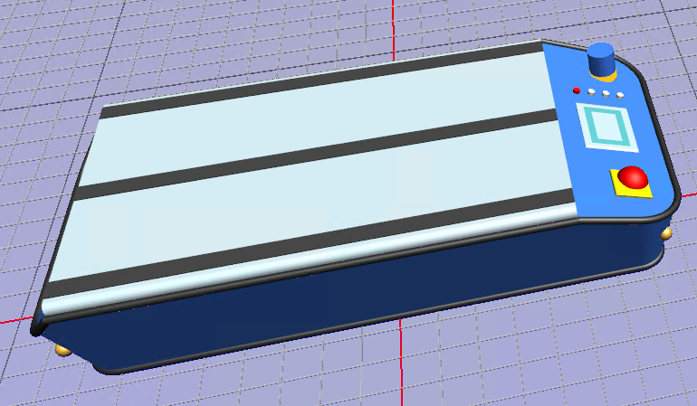
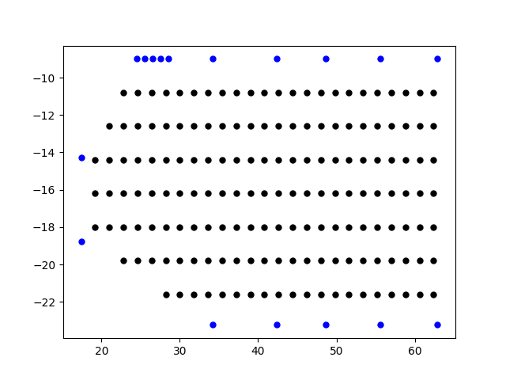
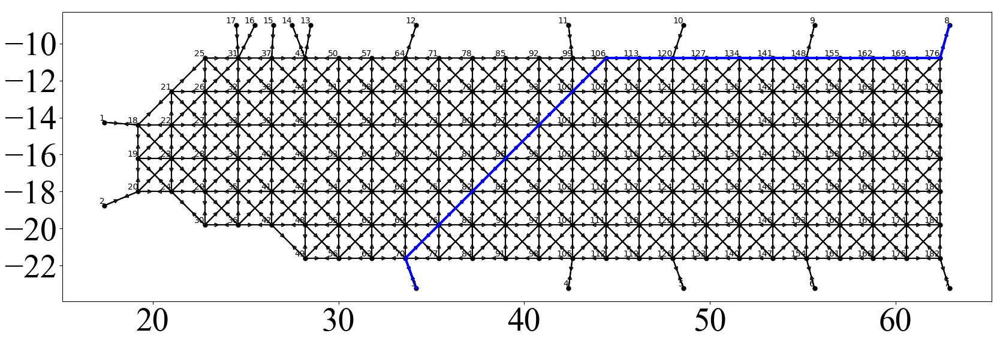
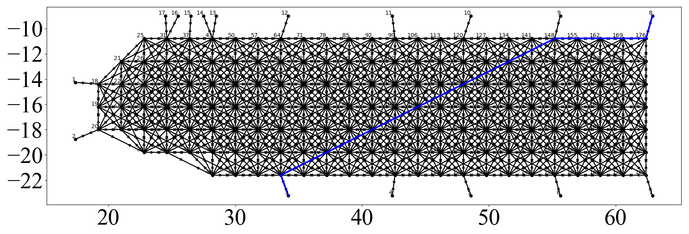

# AGV Scheduling

#### 1. Grid Point Generation, generate grid points based on the AGV length and the boundary nodes of the factory workstation

The following image shows the layout of the factory, and the red square indicates the positions of the workstations, with x and y coordinates, totaling 17 points.

Using the ray-casting algorithm to determine if a point is inside the polygon, with a grid spacing equal to the AGV length.

Grid points can choose between 8-adjacency or 16-adjacency.

The length of the AGV: `Agv_Length = 1.8`

The boundary information of the factory, i.e., the workstation docking points, needs to be stored in order. `Factory_Edge_X = [17.4, 17.4, 34.1887, 42.3887, 48.5887, 55.6387, 62.9045, 62.9045, 55.6387, 48.5887, 42.3887, 34.1887, 28.5, 27.5, 26.5, 25.5, 24.5]``Factory_Edge_Y = [-14.26, -18.75, -23.2283, -23.2283, -23.2283, -23.2283, -23.2283, -9, -9, -9, -9, -9, -9, -9, -9, -9, -9]`

#### 2. A* Algorithm Path Planning

You can choose between Manhattan distance or Euclidean distance.

**8-adjacency path planning**

**16-adjacency path planning**

#### 3.Simulate

<video src="./output/output_video_10agv.mp4"></video>

